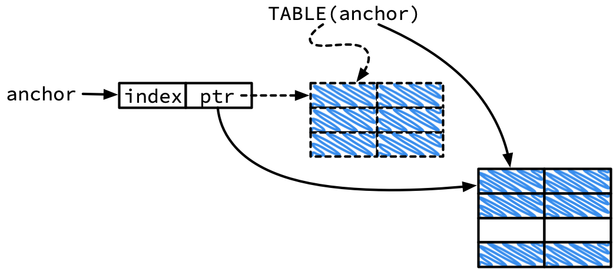
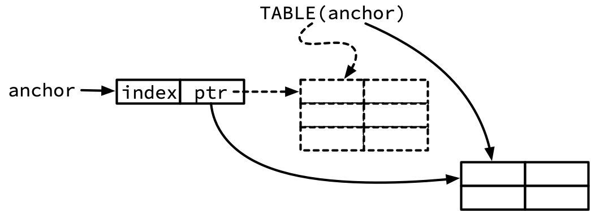
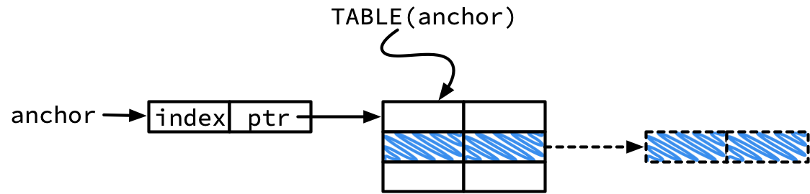

# libhamt

*This is work in progress, in particular the docs.*

A hash array-mapped trie (HAMT) implementation in C99. The implementation
follows Bagwell's 2000 paper[[1]][bagwell_00_ideal], with a focus on clarity
rather than raw speed.

A HAMT is a data structure that can be used to efficiently implement
[*persistent*][wiki_persistent_data_structure] associative arrays (aka maps)
and sets, see the [Introduction](#introduction).

The original motivation for this effort was the desire to understand and
implement an efficient persistent data structure with structural sharing for
maps and sets for [my own Lisp implementation][stutter].

What prompted the somewhat detailed writeup was the realization that there is
not a lot of in-depth documentation for HAMTs beyond the original Bagwell
paper[[1][bagwell_00_ideal]] Some of the more helpful posts are [Karl Krukow's
intro to Clojure's `PersistentHashMap`][krukov_09_understanding], [C. S. Lim's
C++ template implementation][chaelim_hamt], and [Adrian Coyler's morning paper
post][coyler_15_champ] on compressed HAMTs. There is more, but it's all in bits
and pieces. This is an attempt to (partially) improve that situation.

## Quickstart

To build the library and run the tests:

```bash
$ git clone git@github.com:mkirchner/hamt.git
$ cd hamt
$ make
$ make test
```

In order to use `libhamt` in your own projects, copy `include/hamt.h` and
`src/hamt.c` in your own source tree and build from there.

## Table of Contents

* [Introduction](#introduction)
* [API](#api)
   * [HAMT lifecycle](#hamt-lifecycle)
      * [Memory management](#memory-management)
   * [Query](#query)
      * [Iterators](#iterators)
   * [Modification: Insertion &amp; Removal](#modification-insertion--removal)
   * [Using the HAMT as an efficient persistent data structure](#using-the-hamt-as-an-efficient-persistent-data-structure)
   * [Examples](#examples)
      * [Example 1: ephemeral HAMT w/ standard allocation](#example-1-ephemeral-hamt-w-standard-allocation)
      * [Example 2: Changes required for garbage collection and persistence](#example-2-changes-required-for-garbage-collection-and-persistence)
      * [Example 3: Using iterators](#example-3-using-iterators)
* [Implementation](#implementation)
   * [Setup](#setup)
      * [Project structure](#project-structure)
      * [Building the project](#building-the-project)
   * [Design](#design)
      * [Foundational data structures](#foundational-data-structures)
   * [Hashing](#hashing)
      * [Hash exhaustion: hash generations and state management](#hash-exhaustion-hash-generations-and-state-management)
   * [Table management](#table-management)
   * [Putting it all together](#putting-it-all-together)
      * [Search](#search)
      * [Insert](#insert)
      * [Remove](#remove)
      * [Iterators](#iterators-1)
   * [Persistent data structures and structural sharing](#persistent-data-structures-and-structural-sharing)
      * [Basic idea: path copying](#basic-idea-path-copying)
      * [Insert](#insert-1)
      * [Remove](#remove-1)
* [Appendix](#appendix)
   * [Unit testing](#unit-testing)
* [Footnotes](#footnotes)

# Introduction

A *hash array mapped trie (HAMT)* is a data structure that can be used to
implement [associative arrays][wiki_associative_array] (aka maps) and
[sets][wiki_set_adt].

Structurally, HAMTs are [hash trees][wiki_hash_tree] that combine favorable
characteristics of [hash tables][wiki_hash_table] and array mapped
[tries][wiki_trie], namely almost hash table-like time complexity
guarantees[[1]][bagwell_00_ideal] (O(log<sub>32</sub>n)) and economic use of memory.

An additional benefit, and a key motivation for the work presented here, is that
augmentation of HAMTs with path copying and garbage collection allows for a
straightforward and efficient implementation of [persistent][wiki_persistent]
versions of maps and sets.

The remaining documentation starts with a description of the `libhamt` API and
two examples that demonstrate the use of a HAMT as an ephemeral and persistent
data structure, respectively. I then detail the implementation: starting from
the foundational data structures and the helper code required for hash
exhaustion and table management, we cover search, insertion, removal, and
iterators. The final implementation section introduces path copying and explains
the changes required to support persistent insert and remove operations. We
close with an outlook and an appendix.

# API

## HAMT lifecycle

The core data type exported in the `libhamt` interface is `HAMT`. In order to
create a `HAMT` instance, one must call `hamt_create()`, which requires a
hash function of type `hamt_key_hash_fn` to hash keys, a comparison function of
type `hamt_cmp_fn` to compare keys, and a pointer to a `hamt_allocator` instance.
`hamt_delete()` deletes `HAMT` instances that were created with `hamt_create()`.


```c
/* The libhamt core data structure is a handle to a hash array-mapped trie */
typedef struct hamt_impl *HAMT;

/* Function signature definitions for key comparison and hashing */
typedef int (*hamt_cmp_fn)(const void *lhs, const void *rhs);
typedef uint32_t (*hamt_key_hash_fn)(const void *key, const size_t gen);

/* API functions for lifecycle management */
HAMT hamt_create(hamt_key_hash_fn key_hash, hamt_cmp_fn key_cmp, struct hamt_allocator *ator);
void hamt_delete(HAMT);
```

The `hamt_key_hash_fn` takes a `key` and a generation `gen`. The expectation is
that the supplied hash function returns different hashes for the same key but
different generations. Depending on the choice of hash function this can be
implemented using `gen` as a seed or modifying a copy of `key` on the fly.
See the [examples](#examples) section for a `murmur3`-based implementation and
the [hashing](#hashing) section for more information on suitable hash functions.


### Memory management

`libhamt` exports its internal memory management API through the `hamt_allocator`
struct. The struct specifies the functions that the HAMT implementation uses to
allocate, re-allocate and deallocate system memory. The API provides a default
`hamt_allocator_default` which refers to the standard `malloc()`, `realloc()`
and `free()` functions.

```c
struct hamt_allocator {
    void *(*malloc)(const size_t size);
    void *(*realloc)(void *chunk, const size_t size);
    void (*free)(void *chunk);
};

extern struct hamt_allocator hamt_allocator_default;
```

Exporting the `libhamt` memory management API enables library clients to make
use of alternate memory management solutions, most notably of garbage collection
solutions (e.g. the [Boehm-Demers-Weiser GC][boehm_gc]) which are required when
using the HAMT as a persistent data structure (see the [structural sharing
example](#example-2-garbage-collected-persistent-hamts)).


## Query

```c
size_t hamt_size(const HAMT trie);
const void *hamt_get(const HAMT trie, void *key);
```

The `hamt_size()` function returns the size of the HAMT in O(1). Querying the
HAMT (i.e. searching a key) is done with `hamt_get()` which takes a pointer to a
key and returns a result in O(log<sub>32</sub> n) - or `NULL` if the key does
not exist in the HAMT.

### Iterators

The API also provides key/value pair access through the `hamt_iterator` struct.
```c
size_t hamt_size(const HAMT trie);
const void *hamt_get(const HAMT trie, void *key);
```

Iterators are tied to a specific HAMT and are created using the
`hamt_it_create()` function, passing the HAMT instance the iterator should refer
to. Iterators can be advanced with the `hamt_it_next()` function and as long as
`hamt_it_valid()` returns `true`, the `hamt_it_get_key()` and
`hamt_it_get_value()` functions will return the pointers to the current
key/value pair. In order to delete an existing and/or exhausted iterator, call
`hamt_it_delete()`.

```c
typedef struct hamt_iterator_impl *hamt_iterator;

hamt_iterator hamt_it_create(const HAMT trie);
void hamt_it_delete(hamt_iterator it);
bool hamt_it_valid(hamt_iterator it);
hamt_iterator hamt_it_next(hamt_iterator it);
const void *hamt_it_get_key(hamt_iterator it);
const void *hamt_it_get_value(hamt_iterator it);
```

Iterators maintain state about their traversal path and changes to the HAMT
that an iterator refers to implicitly invalidate the iteration (i.e. undefined
behavior).

The order in which iterators return the key value pairs is fully defined by
the structure of the trie, which, in turn, is completely defined by the choice
of hash function and (where applicable) seed.


## Insert & Remove

`libhamt` supports ephemeral and
[persistent][wiki_persistent] (aka not ephemeral) HAMTs through two different interfaces:
`hamt_set()` and `hamt_remove()` for ephemeral use, and their `p`-versions
`hamt_pset()` and `hamt_premove()` for persistent use.

### Ephemeral modification

```c
const void *hamt_set(HAMT trie, void *key, void *value);
void *hamt_remove(HAMT trie, void *key);
```

`hamt_set()` takes a pair of `key` and `value` pointers and adds the pair to the HAMT,
returning a pointer to the `value`. If the `key` already exists, `hamt_set()`
updates the pointer to the `value`.

`hamt_remove()` takes a `key` and removes the key/value pair with the
respective `key` from the HAMT, returning a pointer to the `value` that was
just removed. If the `key` does not exist, `hamt_remove()` returns `NULL`.

### Persistent HAMTs

The semantics of persistent HAMTs are different from their ephemeral
counterparts: since every modification creates a new version of a HAMT, the
modificiation functions return a new HAMT. Modification of a persistent HAMT
therefore requires a reassignment idiom if the goal is modification only:

```c
HAMT h = hamt_create(...)
...
/* Set a value and drop the reference to the old HAMT; the GC
 * will take care of cleaning up remaining unreachable allocations.
 */
h = hamt_pset(h, some_key, some_value);
...
```

This seems wasteful at first glance but the respective functions implement structural
sharing such that the overhead is limited to *~log<sub>32</sub>(N)* nodes (where *N* is the
number of nodes in the graph).

```c
const HAMT hamt_pset(const HAMT trie, void *key, void *value);
const HAMT hamt_premove(const HAMT trie, void *key);
```

`hamt_pset()` inserts or updates the `key` with `value` and returns an opaque
handle to the new HAMT. The new HAMT is guaranteed to contain the new
key/value pair.

`hamt_premove()` attempts to remove the value with the key `key`. It is *not*
an error if the key does not exist; the new HAMT is guaranteed to not contain
the key `key`.

## Examples

### Example 1: ephemeral HAMT w/ standard allocation

```c
#include <stdint.h>
#include <stdio.h>
#include <stdlib.h>
#include <string.h>

#include "hamt.h"
#include "murmur3.h"


static uint32_t hash_string(const void *key, const size_t gen)
{
    return murmur3_32((uint8_t *)key, strlen((const char *)key), gen);
}

int main(int argn, char *argv[])
{
    enum { N = 5; };
    struct {
        char *country;
        char *capital;
    } cities[N] = {
        {"Germany", "Berlin"},
        {"Spain", "Madrid"},
        {"Italy", "Rome"},
        {"France", "Paris"},
        {"Romania", "Bucharest"}
        /* ... */
    };

    HAMT t;

    /* create table */
    t = hamt_create(hash_string, strcmp, &hamt_allocator_default);
    /* load table */
    for (size_t i = 0; i < N; i++) {
        hamt_set(t, cities[i].country, cities[i].capital);
    }

    /* query table */
    for (size_t i = 0; i < N; i++) {
        printf("%s has capital %s\n", cities[i].country,
                                      hamt_get(t, cities[i].country));
    }
    /* cleanup */
    hamt_delete(t);
    return 0;
}
```

### Example 2: Garbage-collected persistent HAMTs

The key to making use of structural sharing is to provide `libhamt` with a
`struct hamt_allocator` instance that implements garbage collection.

The example below uses the the [Boehm-Demers-Weiser][boehm_gc] GC. For
GC installation, compilation and linking instructions, please refer to the GC
documentation.

In brief, the Boehm GC provides a `gc.h` include file and drop-in replacements
for the standard memory management functions, including `malloc`, `realloc`
and `free`.

The following snippet illustrates the required changes:

```c
...
#include "gc.h"  /* Boehm-Demers-Weiser GC */

...

inline void nop(void *_) { return; }

int main(int argc, char *argv[]) {
    ...
    /*
    Set up garbage collection. We set the function pointer for `free` to
    NULL to avoid explicit freeing of memory.
    */
    struct hamt_allocator gc_alloc = {GC_malloc, GC_realloc, nop};
    t = hamt_create(hash_string, strcmp, &gc_alloc);
    ...
}
```

We set the `gc_alloc.free` function pointer to point to `nop()`, a
no-operation function. This is necessary to ensure that we rely on the garbage
collector. If we were to provide a pointer to `GC_free()` (i.e. GC's drop-in
replacement for the `free()` function), we would still implement explicit
deallocation, just with a different free function.

### Example 3: Iterators

The following snipped illustrates how to create, test, exhaust and dispose of
an iterator. We first create the iterator using `hamt_it_create()`, jump into
a `while` loop and advance the iterator using `hamt_it_next()` while the
iterator is valid. In every interation we print the current key/value pair to
`stdout`. Once we exit the loop, we clean up using `hamt_it_delete()`.

```c
    ...
    HAMT t = hamt_create(hash_string, strcmp, &hamt_allocator_default);

    /* load table */
    ...

    /* create iterator */
    hamt_iterator it = hamt_it_create(t);
    while (hamt_it_valid(it)) {
        printf("(%s, %s)\n", (char *)hamt_it_get_key(it),
                             (char *)hamt_it_get_value(it));
        hamt_it_next(it);
    }
    /* clean up */
    hamt_it_delete(it);

    ...
    hamt_delete(t);
    ...
```

This concludes the description of the `libhamt` interface and we now move on
to detailed implementation notes.

# Implementation

## Prelude: Setup

### Project structure

The `hamt` source tree has the following structure:

```
hamt/
  build/         Out-of-source build destination
  include/       Header files that are part of the interface
  src/           Source and header files
  test/          Test and utility headers & sources
  Makefile
```

Sources are organized in three folders: the `include` folder, for all header
files that are part of the public interface; the `src` folder, for the
actual implementation and private header files; and the `test` folder, for all
test code, including headers and sources for testing utilities (e.g. data
loading and benchmarking functions).

The build process is governed by a single `Makefile` in the project root
directory.

### Programming Style

### Building the project

To build the library and run the tests:

```
$ make && make test
```

And, optionally, to run the performance tests:

```
$ make perf
```

The latter requires a somewhat current Python 3 installation with
`matplotlib` and `pandas` packages for graphing.

## Design

### Introduction

**Hash tables.** A common and practical answer to efficient value retrieval
from a collection given a key is to "use a *hash table*".  This is good
advice. *Hash tables* provide insert, modification, and retrieval in amortized
constant average time, using space linear in the number of elements they
store.  They have been the subject of intensive research and
optimization and are part of [every][sedgewick_11_algorithms]
[introductory][cormen_09_introduction] CS textbook.  Chances are that the
standard library of the languange at hand contains a readily available, tried
and tested implementation.

For instance, `std::unordered_set` and `std::unordered_map` (and their
`*_multiset` cousins) are hash table implementations for C++ <sup
id="ac_hash_table_cpp">[1](#fn_hash_table_cpp)</sup>; for C, multiple
[libc][wiki_libc] implementations (e.g. [glibc][wiki_glibc], [musl][musl],
[BSD libc][wiki_bsd_libc]) provide POSIX-compliant `hsearch` facilities,
GNOME's [GLib][wiki_glib]
and others provide [hash table][glib_hashtable] implementations<sup
id="ac_hash_table_c">[2](#fn_hash_table_c)</sup>. Python has the `dict` type
for associative arrays which [is implemented as a hash
table][python_dict_pre36]<sup
id="ac_hash_table_python">[3](#fn_hash_table_python)</sup>.  Java has
`Hashtable`, `HashMap`, and `HashSet` <sup
id="ac_hash_table_java">[4](#fn_hash_table_java)</sup> and JavaScript has
[`Map`][js_map].

One property of the classical hash table implementations is that they do not
provide support for *persistence* (in the sense of [persistent data
structures][wiki_persistent], not persistent storage). They are a
[place-oriented][hickey_value_of_values] solution to associative storage and
make destructive modifications to the data structure when the data changes
(note that this is independent of any particular conflict resolution and
capacity maintenance strategies).

Persistent associative containers require a different approach.

**Persistent data structures.** *(Full) persistence* is the property of a data
structure to always preserve (all) previous versions if itself under
modification. The property is related to
[immutability][wiki_immutable_object]: from the perspective of the client,
every update yields a new copy, making instances practically immutable. This
is a huge conceptual change: if data structures are immutable, functions using
these data structures are pure (i.e. side effect-free). That in turn enables
[value semantics][wiki_value_semantics], [referential
transparency][wiki_referential_transparency], and, consequently, substantial
reduction in programming complexity when dealing with paralellism and
synchronization (see e.g. Rich Hickey's presentations on [*The Value of
Values*][hickey_value_of_values] and [*Are We There
Yet?*][hickey_are_we_there_yet]).

The catch is that classical hash tables set a high bar in terms of time and
space performance characteristics, and persistent data structures need to
approximate that bar.

**Efficient persistence.** Persistent associative data structures need to
minimize the memory overhead introduced by value
semantics (i.e. returning copies as opposed to modified originals) and, at
the same time, provide practically average constant time insert, retrieve and
delete capabilities to minimize the performance gap to classical hash tables.

It turns out that the data structure of choice to tackle these challenges is a
*tree*. Trees support efficient [*structural
sharing*][wiki_structural_sharing] strategies for efficient memory management
and, if they are *balanced* and have *large branching factors*, provide
O(log<sub>k</sub> N) average performance guarantees.

*Persistent hash array-mapped tries* are, in essence, a sophisticated,
practical implementation of such a data structure.


### Persistent Hash Array-Mapped Tries

One way to understand hash array-mapped tries is to look at them as an
evolution of *k*-ary trees (Fig. 1) that follows from a series of real-world
tradeoffs.

<p align="center">
</img>
</p>
<p class="image-caption"><b>Figure 1:</b> *k*-ary tree, hash tree, and
hash array-mapped trie.</p>

In classic *k*-ary trees Ⓐ,  Internal and leaf nodes have
different types: internal nodes point to *n* internal or leaf nodes and leaf
nodes hold or point to data (i.e. the keys/value pairs). In their basic form,
*n*-ary trees (just like binary trees) are not balanced and their performance
characteristics can easily degrade from *O(log<sub>k</sub> n)* to *O(n)*
for degenerate input sequences.

One approach to balanced trees are explicit implementations of
tree rebalancing (as in e.g. [Red-black
trees][wiki_red_black_trees], [AVL trees][wiki_avl_trees], or
[B-trees][wiki_b_trees]).

Another option is to use a [*hash tree*][wiki_hash_tree] Ⓑ: like the name
implies, it uses the *hash* of the key, interpreted as a sequence of *b*-bit
groups, to detetermine the location of the leaf node that stores the key/value
pair. The group size *b* determines the branching factor 2<sup><i>b</i></sup>,
i.e. for *b*=5, every node can have 2<sup>5</sup>=32 child nodes.
Instead of implementing explicit tree rebalancing, hash trees rely on the
distributional properties of a (good) hash function to place nodes uniformly.
While this saves some effort for rebalancing, note that hash trees *do*
require a strategy to deal with *hash exhaustion*, a topic covered below.

The challenge with vanilla hash trees is that they reserve space for *k*
children in every internal node. If the tree is sparsely populated this will
cause significant memory overhead and impact performance due to cache misses.

For that reason, HAMTs implement *array mapping* Ⓒ: instead of reserving space
for *n* pointers to children in each internal node, the parent node stores a
bitmap that indicates which children are present and the actual node only
allocates the memory required to refer to its children. This is an important
optimization that makes trees with a high branching factor more memory
efficient and cache-friendly.

In order to implement a *persistent* map or set, every modification operation
must return a modified copy and maintain the source data structure. And
returning actual copies is prohibitively expensive in time and memory.

This, finally, is where HAMTs really shine and the true reason why we build
them in the first place.

HAMTs are trees and trees are compatible with
[structural sharing][wiki_persistent_data_structure] strategies. Common
techniques are copy-on-write, fat nodes, [path
copying][wiki_persistent_structural_sharing], and there are [complex
combinations of the previous three][driscoll_86_making]. Path copying is
simple, efficient and general and therefore the technique of choice for
`libhamt`: Instead of returning an actual copy of the tree during an insert,
update or delete operations, we follow the search path to the item in
question, maintaining a path copy with all the nodes along the way, make our
modification along this path and return it to the caller.

Note that enabling persistence *requires* the use of a garbage collection
strategy. Under stanard `malloc()` memory management, there is no way for
the HAMT nodes to know how many descendants of a HAMT refer to them.

### Implementation strategy

In the following we will address these concepts in turn: we first define the
foundational data structure used to build a tree and introduce the concept of
an *anchor*. We then dive into hash functions and the *hash state management*
required to make hashing work for trees of arbitrary depths and in the
presence of hash collisions. Lastly, we turn to *table management*,
introducing a set of functions used to create, modify, query and dispose of
mapped arrays.  With these pieces in place, we are ready to implement the
insert/update, query, and delete functions for non-persistent HAMTs. And
lastly, we will then introduce the concept of path copying and close with the
implementation of persistent insert/update and delete functions for HAMTs.


### Foundational data structures
<!--
<p align="center">
</img>
</p>
<p class="image-caption"><b>Figure 1:</b> HAMT data structure.
<code>libhamt</code> implements
HAMTs using linked, heap-allocated tables. Table rows hold
either an index vector and pointer to a subtable or pointers to key and
value (one pair of key/value pointers illustrated in blue, and implicit to all
empty table fields).</p>
-->

`libhamt` uses different types to implement internal and leaf nodes.

Leaf nodes contain two fields, called `value` and `key` (the rationale for the
reverse ordering of the two fields will become evident shortly).
```c
struct {
    void *value;
    void *key;
} kv;
```
Both fields are
defined as `void*` pointers to support referring to arbitrary data types via
type casting
<sup id="ac_cpp_virtual_method_table">[5](#fn_cpp_virtual_method_table)</sup>.

`libhamt`'s internal nodes are where the magic happens, based on Bagwell's *[Ideal Hash
Trees][bagwell_00_ideal]* paper and according to the design principles
outlined above.

With a branching factor *k*, internal nodes have at most *k* successors but
can be sparsely populated. To allow for a memory-efficient representation,
internal nodes have a pointer `ptr` that points to a fixed-size, right-sized
*array* of child nodes (also known as a *table*) and a *k*-bit `index` bitmap field that
keeps track of the size and occupancy of that array.

`libhamt` uses *k*=32 and because `index` is a 32-bit bitmap field, the number
of one-bits in `index` yields the size of the array that `ptr` points to (also
known as the *population count* or `popcount()` of `index`).

This suggests an initial (incomplete) definition along the following lines:
```c
struct {
    struct T *ptr;  /* incomplete */
    uint32_t index;
} table;
```

The specification of `T` must provide the ability for that datatype to point to
internal and external nodes alike, using only a single pointer type.
A solution is to wrap the two types into a `union` (and then to wrap
the `union` into a `typedef` for convenience):

```c
typedef struct hamt_node {
    union {
        struct {
            void *value;
            void *key;
        } kv;
        struct {
            struct hamt_node *ptr;
            uint32_t index;
        } table;
    } as;
} hamt_node;
```

With this structure, given a pointer `hamt_node *p` to a `hamt_node`
instance, `p->as.kv` addresses the leaf node, and `p->as.table` addresses the
internal node and `p->as.kv.value`, `p->as.kv.key`, `p->as.table.ptr`, and
`p->as.table.index` provide access to the respective fields.

To maintain sanity, we define the following convenience macros:

```c
#define TABLE(node) node->as.table.ptr
#define INDEX(node) node->as.table.index
#define VALUE(node) node->as.kv.value
#define KEY(node)   node->as.kv.key
```

<p align="center">
</img>
</p>
<p class="image-caption"><b>Figure 2:</b>
Memory structure of an internal node. If <code>node</code> is a pointer
to an internal node, <code>TABLE(node)</code> (or, equivalently, <code>
node->as.table.ptr</code>) points to the first field of the successor table.
</p>

### The Anchor

The `libhamt` codebase makes liberal use of the concept of an *anchor*.  An
*anchor* is a `hamt_node*` pointer to an internal node (i.e.
`is_value(VALUE(anchor))` evaluates to false). An `anchor` provides access to
all information relevant to manage the table of child nodes: `INDEX(anchor)`
returns the bitmap that encodes the array mapping, applying a popcount to the
bitmap gives the size of the table and indexing is implemented using partial
popcounts. Table elements can be accessed through
`TABLE(anchor)[i]`, where `i` must be in the valid range.


### Pointer tagging

The definition of `hamt_node` enables the construction of trees with a mix of
internal and leaf nodes. What the definition does not provide, is a way to
determine if a concrete `hamt_node*` pointer points to an internal or a leaf
node. One solution would be to specify an `enum` that indicates the type
(i.e. `NODE_LEAF`, etc.) and to add a `type` field to `struct hamt_node`.  While
valid, this would also increase the size of the struct by 50% just to maintain
a single bit of information. Luckily, there is a more memory-efficient
solution: pointer tagging.

Since pointers need to be word-aligned, that leaves the lower 3 bits of all
pointers on 64-bit architectures always set to zero. It is possible to make
use of these bits under two conditions: (1) we know we are looking at a
pointer (the bottom three bits for the integer 1 are zero, too); and (2) we
carefully mask the bits in question whenever we actually use the pointer
(since it would point to the wrong location otherwise). The first is not a
problem since we own the code; the second requires diligence and some helper
functions:

```c
#define HAMT_TAG_MASK 0x3
#define HAMT_TAG_VALUE 0x1
#define tagged(__p) (hamt_node *)((uintptr_t)__p | HAMT_TAG_VALUE)
#define untagged(__p) (hamt_node *)((uintptr_t)__p & ~HAMT_TAG_MASK)
#define is_value(__p) (((uintptr_t)__p & HAMT_TAG_MASK) == HAMT_TAG_VALUE)
```

In order to mark a leaf node as such, we set `key` as usual and tag the value
pointer before assigning it to `value`:

```c
    p->as.kv.key = key_ptr;
    p->as.kv.value = tagged(value_ptr);
```

Given a pointer to a leaf (e.g. a search result), we untag `value` before
returning it:

```c
    ...
    if (status == SEARCH_SUCCESS) {
        return untagged(p->as.kv.value);
    }
    ...
```

And, in order to determine what we are looking at, we use `is_value`:

```c
    if (is_value(p->as.kv.value)) {
        /* this is a leaf */
        ...
    } else {
        /* this is an internal node */
        ...
    }
```

Pointer tagging is the reason why the `value` and `key`
fields in the `struct kv` struct are ordered the way they are.
The `union` in `hamt_node` causes the
memory locations of the `struct kv` and `struct table` structs to overlap. Since
the `table.index` field is *not* a pointer (and the bottom-three-bits-are-zero
guarantee does not apply), its storage location cannot be used for pointer
tagging, leaving the `table.ptr` to the task. Putting `kv.value` first,
aligns the value field with `table.ptr`. The reverse order would work, but the
`kv.key` pointer is dereferenced much more often in the code and so it is more
convenient to use `kv.value`.


## Array mapping

The principal idea behing array mapping is to project a sparse bitmap index
onto the index of a dense array, where the size of the array corresponds to
the number of non-zero bits in the bitmap index.

Given `hamt_node *p` is a valid pointer to a node, `INDEX(p)` corresponds to a
sparse bitmap index. The dense array is located at `TABLE(p)` and its size is
determined by the [*population count*][wiki_popcount] of `INDEX(p)`.

The mapping itself is conceptually trivial: to determine the dense index for
every non-zero bit in the bitmap index, count the number of non-zero bits to
the right of it. In other words, the first set bit goes to index 0, the second
to index 1, and so forth.

Efficiently implementing population counting (also known as the hamming
weight) of a bitset is [not trivial][wiki_popcount]. `libhamt` falls back on a
GCC/Clang intrinsic:

```c
static inline int get_popcount(uint32_t n) { return __builtin_popcount(n); }
```

With `get_popcount()` available, determining the position (i.e. dense index)
for a sparse index in a bitmap reduces to calculating the population count of
the bitmap masked off above the sparse index:

```c
static inline int get_pos(uint32_t sparse_index, uint32_t bitmap)
{
    return get_popcount(bitmap & ((1 << sparse_index) - 1));
}
```

Lastly, to determine if a node has a child at a particular index `index`, we
check if the bit at that index is set in the bitmap:

```c
static inline bool has_index(const hamt_node *anchor, size_t index)
{
    return INDEX(anchor) & (1 << index);
}
```

## Hashing

A [*hash function*][wiki_hash_function] is a function that takes data of
arbitrary size and maps it to a fixed-size value (often machine word sizes).
*Good* hash functions are fast to compute and produce *uniform* output, they
map their inputs as evenly as possible over the output range.  If it is
practically infeasible to invert the mapping (i.e. determine which hash
corresponds to which input value), the hash function is called a [cryptographic
hash function][wiki_cryptographic_hash_function].

For the purpose of implementing a HAMT, cryptographical security is not a
design goal. However, the uniformity of the hash function has direct impact on
the balance of the tree: it is the hash that pre-determines all key positions
in the fully populated tree and it is its distribution properties that
determines the number of collisions (and hence depth extensions) we introduce.

`libhamt` does not force clients to use a particular hash function. The
libary exposes a hash function signature of the form

```c
typedef uint32_t (*hamt_key_hash_fn)(const void *key, const size_t gen);
```

and expects users to provide a suitable function pointer as part of the call to
`hamt_create()` which, among other parameters, takes a hash function:

```c
/* ... see below for a practical definition of my_keyhash_string */

    HAMT t = hamt_create(my_keyhash_string, my_keycmp_string,
                         &hamt_allocator_default);
```

There are multiple [good, practical choices][why_simple_hash_functions_work]
for the HAMT.  Per default `libhamt` includes its [own][hamt_src_murmur],
[tested][hamt_src_test_murmur] implementation of 32-bit
[MurmurHash3][wiki_murmurhash]:

```c
/* from include/murmur3.h */

uint32_t murmur3_32(const uint8_t *key, size_t len, uint32_t seed);
```

This declares the *murmur* hash function. In its standard form `murmur3_32`
takes a pointer `key` to byte-sized objects, a count of `len` that speficies
the number of bytes to hash and a random seed `seed`.

In order to use murmur3 as a `hamt` hash function, we need to wrap it into a
helper function:

```c
static uint32_t my_keyhash_string(const void *key, const size_t gen)
{
    uint32_t hash = murmur3_32((uint8_t *)key, strlen((const char *)key), gen);
    return hash;
}
```

Here, the wrapper makes use of `strlen(3)`, assuming valid C strings as keys.
Note the use of `gen` as a seed for the hash (see below for the hash exhaustion
discussion).

Here is a full example:

```c
#include "murmur3.h"

/* ... */

static uint32_t my_keyhash_string(const void *key, const size_t gen)
{
    uint32_t hash = murmur3_32((uint8_t *)key, strlen((const char *)key), gen);
    return hash;
}

/* ... */

    HAMT t = hamt_create(my_keyhash_string, my_keycmp_string,
                         &hamt_allocator_default);

```


### Hash exhaustion: hash generations and state management

For a hash trie, the number of elements in the trie is limited by the total number
of hashes that fits into a 32-bit `uint32_t`, i.e. 2^32-1. Since the HAMT only
uses 30 bits (in 6 chunks of 5 bits), the number of unique keys in the trie is
limited to 2<sup>30</sup>-1 = 1,073,741,823 keys.
At the same time, since every layer of the
tree uses 5 bits of the hash, the trie depth is limited to 32/5 = 6 layers.
Neither the hard limit to the number of elements in the trie,
nor the inability to build a trie beyond depth of 6 are desirable properties.

To address both issues, `libhamt` recalculates the hash with a different seed every
6 layers. This requires a bit of state management and motivates the
existence of the `hash_state` data type and functions that operate on it:

```c
typedef struct hash_state {
    const void *key;
    hamt_key_hash_fn hash_fn;
    uint32_t hash;
    size_t depth;
    size_t shift;
} hash_state;
```
The struct maintains the pointers `key` to the key that is being hashed and
`hash_fn` to the hash function used to calculate the current hash `hash`. At
the same time, it tracks the current depth `depth` in the tree (this is the
*hash generation*) and the bitshift `shift` of the current 5-bit hash chunk.

The interface provides two functions: the means to step from the current 5-bit
hash to the next in `hash_next()`; and the ability query the current index of a
key at the current trie depth in `hash_get_index()`.

`hash_next()` takes a pointer to a `hash_state` instance and steps that instance
from the current to the next chunk. Taking a step involves increasing the
`depth` and `shift`, and initiating a rehash if the `shift` indicates
that the hash has been exhausted:

```c
static inline hash_state *hash_next(hash_state *h)
{
    h->depth += 1;
    h->shift += 5;
    if (h->shift > 30) {
        h->hash = h->hash_fn(h->key, h->depth / 5);
        h->shift = 0;
    }
    return h;
}
```

The index of a hash at its current depth corresponds to the decimal
representation of the current chunk. To determine the current chunk,
we right-shift the hash by `h->shift` to right-align the desired
LSB and then mask with `0x11111` which equals `0x1f`:

```c
static inline uint32_t hash_get_index(const hash_state *h)
{
    return (h->hash >> h->shift) & 0x1f;
}
```


## Table management

In order to facilitate memory management for tables (aka the internal nodes),
`libhamt` defines a set of helper functions. Each of these functions takes a
`hamt_allocator` and calls the user-supplied allocation, re-allocation and
deallocation functions as appropriate.

We start by defining a simple memory abstraction (it would also be correct to use real functions
instead of preprocessor macros for this):

```c
#define mem_alloc(ator, size) (ator)->malloc(size)
#define mem_realloc(ator, ptr, size) (ator)->realloc(ptr, size)
#define mem_free(ator, ptr) (ator)->free(ptr)
```

This will make it easier to add optimizations (e.g. table caching) in the
future. On top of these macros, table lifecycle management is accomplished
with a few dedicated allocation and de-allocation functions.


### Simple allocation and deallocation

`table_allocate()` allocates tables with size `size` and returns a pointer to
the newly allocated table.

```c
hamt_node *table_allocate(struct hamt_allocator *ator, size_t size)
{
    return (hamt_node *)mem_alloc(ator, (size * sizeof(hamt_node)));
}
```

`table_free()` deallocates the allocation referenced by `ptr`. It also
supports taking a `size` parameter for future extension (e.g. provide a hint
for allocation pool management) that is currently ignored by the underlying
`mem_free()` implementation.

```c
void table_free(struct hamt_allocator *ator, hamt_node *ptr, size_t size)
{
    mem_free(ator, ptr);
}

```

### Specialized table resize operations

While it is possible to implement table re- and right-sizing with the
two functions introduced above, it makes a lot of sense to provide specialized
functionality for the key allocation/de-allocation use cases: extending,
shrinking and gathering a table.

**Table extension.** Since the tables in a HAMT are right-sized to minimize
memory overhead, item insertion must necessarily add an additional row to an
existing table. As illustrated in figure 3, the table extension function takes an anchor for an existing
table, allocates a new table with increased size, copies over the exsiting
entries (leaving a gap at the appropriate position for the new row), assigns
the new key and value to the fields in the new row, updates the anchor with
the new memory location of the table and the new index, and eventually frees the
memory of the old table.


<p align="center">
</img>
</p>
<p class="image-caption"><b>Figure 3:</b>
Extending a table creates a new copy of the existing table with an additional
row for the new node.
</p>

Looking at the code, this is implemented in verbatim in the `table_extend()`
function. `table_extend()` takes an `anchor` pointer to a table of
size `n_rows`, then uses the allocator `ator` to create a new table of size `n_rows + 1`
with an empty row at position `pos` and the bitmap index bit `index` set. It
uses `memcpy()` to copy memory ranges into the the appropriate positions in
the new allocation, frees the old table and assignes the new table `ptr` and
`index` in the anchor:


```c
hamt_node *table_extend(struct hamt_allocator *ator, hamt_node *anchor,
                       size_t n_rows, uint32_t index, uint32_t pos)
{
    hamt_node *new_table = table_allocate(ator, n_rows + 1);
    if (!new_table)
        return NULL;
    if (n_rows > 0) {
        /* copy over table */
        memcpy(&new_table[0], &TABLE(anchor)[0], pos * sizeof(hamt_node));
        /* note: this works since (n_rows - pos) == 0 for cases
         * where we're adding the new k/v pair at the end and memcpy(a, b, 0)
         * is a nop */
        memcpy(&new_table[pos + 1], &TABLE(anchor)[pos],
               (n_rows - pos) * sizeof(hamt_node));
    }
    table_free(ator, TABLE(anchor), n_rows);
    TABLE(anchor) = new_table;
    INDEX(anchor) |= (1 << index);
    return anchor;
}
```

**Shrinking a table.** Shrinking a table is the inverse operation of table
extension: since we maintain right-sized tables as an invariant, we need to
adjust table sizes the moment the client deletes a key/value pair from the
HAMT.

Figure 4 illustrates the concept: given an anchor, the shrinking function
returns a new table with the specified row removed.


<p align="center">
</img>
</p>
<p class="image-caption"><b>Figure 4:</b>
Shrinking a table creates a new copy of the table with the specified row
removed.
</p>

In the code, this is what `table_shrink()` does. In the same way as
`table_extend()` the function takes a pointer `ator` to the global allocator,
a pointer `anchor` to the current anchor, the size of the current tables as
`n_rows`, and the pair of one-hot bitmap index `index` and storage array
position `pos`. And, in analogy to table extension, the function allocation a
right-sized table, copies the data to keep using range copies with `memcpy()`,
frees up the old table and updates the anchor to reflect the changes.

```c
hamt_node *table_shrink(struct hamt_allocator *ator, hamt_node *anchor,
                       size_t n_rows, uint32_t index, uint32_t pos)
{
    hamt_node *new_table = NULL;
    uint32_t new_index = 0;
    if (n_rows > 0) {
        new_table = table_allocate(ator, n_rows - 1);
        if (!new_table)
            return NULL;
        new_index = INDEX(anchor) & ~(1 << index);
        memcpy(&new_table[0], &TABLE(anchor)[0], pos * sizeof(hamt_node));
        memcpy(&new_table[pos], &TABLE(anchor)[pos + 1],
               (n_rows - pos - 1) * sizeof(hamt_node));
    }
    table_free(ator, TABLE(anchor), n_rows);
    INDEX(anchor) = new_index;
    TABLE(anchor) = new_table;
    return anchor;
}
```

**Table gathering.** As we are deleting entries from the HAMT, we may end up
with the table structure shown in Figure 5: a table in which one of the
entries is a single-row table. What we want to do in these cases is to replace
the table entry in `TABLE(anchor)[1]` with the key/value pair from
`TABLE(TABLE(anchor)[1])` and *gather* the one-row table into its parent.
While this comes at additional computational cost upon delete, it maintains
the logarithmic depth properties as the HAMT changes its size.

<p align="center">
</img>
</p>
<p class="image-caption"><b>Figure 5:</b>
Gathering pulls a one-row-sized table into its parent table (essentially
converting an internal node into a leaf node).
</p>

The code is straightforward: we take the allocator `alloc`, the `anchor`
pointer, and the position `pos` of the single-row table inside the parent
table, copy over the key and value from the child table to the parent
(maintaining a temporary handle on the child) and then free the child table:

```c
hamt_node *table_gather(struct hamt_allocator *ator, hamt_node *anchor,
                       uint32_t pos)
{
    int n_rows = get_popcount(INDEX(anchor));
    hamt_node *table = TABLE(anchor);
    KEY(anchor) = table[pos].as.kv.key;
    VALUE(anchor) = table[pos].as.kv.value; /* already tagged */
    table_free(ator, table, n_rows);
    return anchor;
}

```

**Table duplication.** Lastly, table duplication. This will be required for path
copying when we implement persistency and it is so straightforward that there
is no diagram: given an anchor, `table_dup()` determines the size of the table
that the anchor points to, allocates the required memory and performs a range
copy using `memcpy()` to duplicate the table contents:

```c
hamt_node *table_dup(struct hamt_allocator *ator, hamt_node *anchor)
{
    int n_rows = get_popcount(INDEX(anchor));
    hamt_node *new_table = table_allocate(ator, n_rows);
    if (new_table) {
        memcpy(&new_table[0], &TABLE(anchor)[0], n_rows * sizeof(hamt_node));
    }
    return new_table;
}
```

## Putting it all together

The following subsections detail the implementations of search, insertion and
removal of key/value pairs in our HAMT implementation. Note that, while the
implementations shown here have been thoroughly tested and are deemed correct,
they may have been replaced by faster or more capable implementations in the
actual `libhamt` source. An attempt is being made to keep this section up to
date with the actual implementation but the choice here is in favor of
conceptual clarity and will not necessarily cover every implementation detail.
PRs welcome.

### Example data

| key | key hash | binary key hash                          | 5-bit ints           |
|-----|----------|------------------------------------------|----------------------|
| "0" | d271c07f | `11 01001 00111 00011 10000 00011 11111` | [ 31  3 16  3  7 9 ] |
| "2" | 0129e217 | `00 00000 10010 10011 11000 10000 10111` | [ 23 16 24 19 18 0 ] |
| "4" | e131cc88 | `11 10000 10011 00011 10011 00100 01000` | [  8  4 19 3 19 16 ] |
| "7" | 23ea8628 | `00 10001 11110 10101 00001 10001 01000` | [  8 17 1 21 30 17 ] |
| "8" | bd920017 | `10 11110 11001 00100 00000 00000 10111` | [ 23 0  0  4 25 30 ] |

### Search: internal API

Search plays a double role: finding a HAMT entry is a fundamental part of the
HAMT interface (exposed by `hamt_get()`); and the first step in the insert and remove
functions is finding the anchors to operate on.

It is therefore desirable to approach the search implementation from a
more generic perspective such that we do not need to re-invent the
wheel for each of these use cases. We therefore define an internal search
function

```c
static ... search_recursive(...);
```

that is called from internal and the API functions alike. As the
name implies, we implement search in a recursive manner (this is for clarity;
conversion to an iterative solution is straightforward).

When we search for a key in the HAMT, there are two fundamental outcomes: the
key is either there, or it is not (note that these are exactly the semantics
of the user-facing `hamt_get()` function: it either returns a pointer to the
value stored under the key or it returns `NULL`). However, looking more
closely, searches can fail for two reasons: the search can be unsuccessful
because a key does not exist in the HAMT *or* it can be unsuccessful because
there is a key value pair that happens to have the same partial hash but a
different key (i.e. there is a hash collission or the hash has not been
sufficiently exhausted to differentiate between the two keys).  And each of
these three cases is meaningful (the latter two corresponding directly to the
two different insertion strategies described below).

A good approach here is to define a ternary return value (as opposed to
the usual, binary use-`NULL`-as-a-failure-indicator approach that is often
prevalent in C code) to allow us to signal each of these cases clearly.

We create a suitable three-value `enum` called `search_status`

```c
typedef enum {
    SEARCH_SUCCESS,
    SEARCH_FAIL_NOTFOUND,
    SEARCH_FAIL_KEYMISMATCH
} search_status;
```

where `SEARCH_SUCCESS` indicates that the key in question was
found, `SEARCH_FAIL_NOTFOUND` indicates a search failure due to a missing key,
and `SEARCH_FAIL_KEYMISMATCH` signals a hash conflict.

In order to return the result of a search (and not only its status), we
introduce a search result data type that is a bit more heavy-weight:

```c
struct search_result {
    search_status status;
    hamt_node *anchor;
    hamt_node *value;
    hash_state *hash;
};
```
Here, `anchor` always points to the anchor at which the search was terminated;
if the search was successful, `value` points to the table row that holds the
key/value pair with matching key; if it was unsuccessful with a key mismatch,
`value` points to the mismatching key/value pair; and if it was unsuccessful
because the key did not exist, `value` equals `NULL`. Depending on the depth
that the search reached, we may have hit hash exhaustion and the hash may have
been recalculated, so we are returning this here, too.

Given `struct search_result`, the return value of `search_recursive()`
becomes:

```c
static struct search_result search_recursive(...)
{
    // ...
}
```

With these prerequisites out of the way, we can tackle the actual search
algorithm:

        search_recursive(anchor, hash, eq, key, ...):
            if the current 5-bit sub-hash is a valid index in the current table: 
                if the index refers to a key/value pair:
                    if the key matches the search key:
                        return SEARCH_SUCCESS
                    else:
                        return SEARCH_FAIL_KEYMISMATCH
                else (i.e. it refers to a sub-table):
                    search_recursive(sub-table, hash_next(hash), eq, key)
            else:
                return SEARCH_FAIL_NOTFOUND

The basic idea is to start from the root of the HAMT and then, at every level,
test if the curret sub-hash of the key is present in the current sub-trie. If
not, bail and report failure immediately. If yes, check if the entry refers to
a key/value pair or to another table. If this is true as well, check if the
keys match and return success or failure accordingly. If the entry refers to
a sub-table, repeat the search at the level of the sub-table.

With the conceptual approach lined out, let's get into the implementation
details.
We start with deriving the table index for the current search level from the
hash. This is accomplished using 
`hash_get_index()`, which encapsulates the bit-fiddling required to extract
the correct 5-bit hash for the current search level and returns the index as
an unsigned integer.

```c
static search_result search_recursive(hamt_node *anchor,
                                      hash_state *hash,
                                      hamt_cmp_fn cmp_eq,
                                      const void *key, ...)
{
    uint32_t expected_index = hash_get_index(hash);
    ...
}
```

The code then checks if the `expected_index` exists in the current table:

```c
    ...
    if (has_index(anchor, expected_index)) {
    ...
    }
```

Here, `has_index()` is a simple helper function that checks if 
the `INDEX(anchor)` bitfield has the bit set at `expected_index`:

```c
static inline bool has_expected_index(const hamt_node *anchor, size_t expected_index)
{
    return INDEX(anchor) & (1 << expected_index);
}
```

If `has_index()` evaluates to false, the key does not exist in the HAMT and we
can immediately fail the search and return the result:

```c
{
    uint32_t expected_index = hash_get_index(hash);
    if (has_index(anchor, expected_index)) {
        ...
        ... 
        ...
    }
    search_result result = {.status = SEARCH_FAIL_NOTFOUND,
                            .anchor = anchor,
                            .value = NULL,
                            .hash = hash};
    return result;
}
```

If `has_index()` evaluates to true, we find the array index using
`get_pos()` (see above), store it into `pos` and then acquire a pointer to the
`next` node by addressing `pos` indices into the `anchor`'s table.

```c
{
    ...
    if (has_index(anchor, expected_index)) {
        /* If yes, get the compact index to address the array */
        int pos = get_pos(expected_index, INDEX(anchor));
        /* Index into the table */
        hamt_node *next = &TABLE(anchor)[pos];
        ...
    }
    ...
}
```

If the `next` node is not a value, we advance the hash state and recurse the
search. If it is, we compare the keys and return success or failure
accordingly:

```c
{
        ...
        /* Index into the table */
        hamt_node *next = &TABLE(anchor)[pos];
        /* Are we looking at a value or another level of tables? */
        if (is_value(VALUE(next))) {
            if ((*cmp_eq)(key, KEY(next)) == 0) {
                /* Found: keys match */
                search_result result = {.status = SEARCH_SUCCESS,
                                        .anchor = anchor,
                                        .value = next,
                                        .hash = hash};
                return result;
            }
            /* Not found: same hash but different key */
            search_result result = {.status = SEARCH_FAIL_KEYMISMATCH,
                                    .anchor = anchor,
                                    .value = next,
                                    .hash = hash};
            return result;
        } else {
            /* For table entries, recurse to the next level */
            return search_recursive(next, hash_next(hash), cmp_eq, key);
        }
```

That concludes the implementation of the recursive search function and the
complete implementation looks like this:

```c
static search_result search_recursive(hamt_node *anchor, hash_state *hash,
                                      hamt_cmp_fn cmp_eq, const void *key)
{
    /* Determine the expected index in table */
    uint32_t expected_index = hash_get_index(hash);
    /* Check if the expected index is set */
    if (has_index(anchor, expected_index)) {
        /* If yes, get the compact index to address the array */
        int pos = get_pos(expected_index, INDEX(anchor));
        /* Index into the table */
        hamt_node *next = &TABLE(anchor)[pos];
        /* Are we looking at a value or another level of tables? */
        if (is_value(VALUE(next))) {
            if ((*cmp_eq)(key, KEY(next)) == 0) {
                /* Found: keys match */
                search_result result = {.status = SEARCH_SUCCESS,
                                        .anchor = anchor,
                                        .value = next,
                                        .hash = hash};
                return result;
            }
            /* Not found: same hash but different key */
            search_result result = {.status = SEARCH_FAIL_KEYMISMATCH,
                                    .anchor = anchor,
                                    .value = next,
                                    .hash = hash};
            return result;
        } else {
            /* For table entries, recurse to the next level */
            return search_recursive(next, hash_next(hash), cmp_eq, key);
        }
    }
    /* Not found: expected index is not set, key does not exist */
    search_result result = {.status = SEARCH_FAIL_NOTFOUND,
                            .anchor = anchor,
                            .value = NULL,
                            .hash = hash};
    return result;
}
```

### Search: external API

The external API for search is `hamt_get(trie, key)` which takes a `trie`
and attempts to find (and return) a key/value pair specified by `key`. Its
implementation uses `search_recursive()` from above:

```c
const void *hamt_get(const HAMT trie, void *key)
{
    hash_state *hash = &(hash_state){.key = key,
                                     .hash_fn = trie->key_hash,
                                     .hash = trie->key_hash(key, 0),
                                     .depth = 0,
                                     .shift = 0};
    search_result sr = search_recursive(trie->root, hash, trie->key_cmp, key,
                                        NULL, trie->ator);
    if (sr.status == SEARCH_SUCCESS) {
        return untagged(sr.VALUE(value));
    }
    return NULL;
}
```

In order to use `search_recursive()`, it is necessary to set up the hash state
management, initializing it with the `key`, the hashed `key`, and starting
search from level `0` (corresponding to a shift of `0`). If the search is
not successful, the function returns `NULL`, if it is successful, it passes
a `void` pointer to the value that corresponds to `key`. Note the *untagging*
of the `value` field since we're using it as a *tagged pointer* to indicate
field types.


### Insert: internal functions

`libhamt` does not support an explicit insertion function; all insertions into
the HAMT are *upserts*, i.e. after calling `hamt_set()` the API guarantees
that the requested key/value pair exists, irrespective of potential previous
entries that may have had the same key but a different value.

The internal function that implements this behavior is `set()`:

```c
static const hamt_node *set(HAMT h, hamt_node *anchor, hamt_key_hash_fn hash_fn,
                            hamt_cmp_fn cmp_fn, void *key, void *value)
```

`set()` takes a HAMT, an anchor in that HAMT, hashing and comparison
functions as well as a key/value pair. After initializing the hash state, the
function makes use of `search_recursive` to find the specified `key`. It deals
with three different search outcomes: (1) if the search is successful, the
value of `key` gets replaced with the new `value`; (2) if the search is
unsuccessful because the key does not exist, it attempts to insert a new
key/value pair at the appropriate position; and (3) if the search fails due to
a key mismatch (i.e. there is an entry at the expected hash position but its
key does not equal `key`), it extends the hash trie until the new key/value
pair can be placed correctly. Cases (2) and (3) are covered by the
`insert_kv()` and `insert_table()` helper functions, respectively.

```c
static const hamt_node *set(HAMT h, hamt_node *anchor, hamt_key_hash_fn hash_fn,
                            hamt_cmp_fn cmp_fn, void *key, void *value)
{
    hash_state *hash = &(hash_state){.key = key,
                                     .hash_fn = hash_fn,
                                     .hash = hash_fn(key, 0),
                                     .depth = 0,
                                     .shift = 0};
    search_result sr =
        search_recursive(anchor, hash, cmp_fn, key, NULL, h->ator);
    const hamt_node *inserted;
    switch (sr.status) {
    case SEARCH_SUCCESS:
        sr.VALUE(value) = tagged(value);
        inserted = sr.value;
        break;
    case SEARCH_FAIL_NOTFOUND:
        if ((inserted = insert_kv(sr.anchor, sr.hash, key, value, h->ator)) !=
            NULL) {
            h->size += 1;
        }
        break;
    case SEARCH_FAIL_KEYMISMATCH:
        if ((inserted = insert_table(sr.value, sr.hash, key, value, h->ator)) !=
            NULL) {
            h->size += 1;
        }
        break;
    }
    return inserted;
}
```

If the call to `search_recursive()` fails with `SEARCH_FAIL_NOTFOUND`, we know
that there is a free row in the table of `sr.anchor`. To insert the new
`key`/`value` pair, we calculate the position of the `key` in the current
table: it extracts the 0-31 index position for the current key and stores it
into `ix`, extends the existing `INDEX(anchor)` index bitmap to include the
new key by setting the `ix`-th bit, and then calculates the dense index
position of the new entry via `get_pos()`. It then uses `table_extend()` to
extend the table to the correct size and populates the `key` and `value`
entries to reflect the new key/value pair. Note the pointer tagging on the
value field to mark it as a key/value row in the table (as opposed to a row
that points to a sub-table).

```c
static const hamt_node *insert_kv(hamt_node *anchor, hash_state *hash,
                                  void *key, void *value,
                                  struct hamt_allocator *ator)
{
    /* calculate position in new table */
    uint32_t ix = hash_get_index(hash);
    uint32_t new_index = INDEX(anchor) | (1 << ix);
    int pos = get_pos(ix, new_index);
    /* extend table */
    size_t n_rows = get_popcount(INDEX(anchor));
    anchor = table_extend(ator, anchor, n_rows, ix, pos);
    if (!anchor)
        return NULL;
    hamt_node *new_table = TABLE(anchor);
    /* set new k/v pair */
    new_table[pos].as.kv.key = key;
    new_table[pos].as.kv.value = tagged(value);
    /* return a pointer to the inserted k/v pair */
    return &new_table[pos];
}
```

When the call to `search_recursive()` in `set()` fails with
`SEARCH_FAIL_KEYMISMATCH`, the situation is different: there is another entry
(either a key/value pair or a reference to a sub-table) in the HAMT that
currently occupies a transitionary trie location for `key`. This is expected
to happen regularly: keys are always inserted with the shortest possible trie
path that resolves hashing conflicts between *existing* keys. As more and more
entries are added to the HAMT, these paths necessarily must increase in
length. This situation is handled by `insert_table()`:

```c
static const hamt_node *insert_table(hamt_node *anchor, hash_state *hash,
                                     void *key, void *value,
                                     struct hamt_allocator *ator)
{
    /* Collect everything we know about the existing value */
    hash_state *x_hash =
        &(hash_state){.key = KEY(anchor),
                      .hash_fn = hash->hash_fn,
                      .hash = hash->hash_fn(KEY(anchor), hash->depth / 5),
                      .depth = hash->depth,
                      .shift = hash->shift};
    void *x_value = VALUE(anchor); /* tagged (!) value ptr */
    /* increase depth until the hashes diverge, building a list
     * of tables along the way */
    hash_state *next_hash = hash_next(hash);
    hash_state *x_next_hash = hash_next(x_hash);
    uint32_t next_index = hash_get_index(next_hash);
    uint32_t x_next_index = hash_get_index(x_next_hash);
    while (x_next_index == next_index) {
        TABLE(anchor) = table_allocate(ator, 1);
        INDEX(anchor) = (1 << next_index);
        next_hash = hash_next(next_hash);
        x_next_hash = hash_next(x_next_hash);
        next_index = hash_get_index(next_hash);
        x_next_index = hash_get_index(x_next_hash);
        anchor = TABLE(anchor);
    }
    /* the hashes are different, let's allocate a table with two
     * entries to store the existing and new values */
    TABLE(anchor) = table_allocate(ator, 2);
    INDEX(anchor) = (1 << next_index) | (1 << x_next_index);
    /* determine the proper position in the allocated table */
    int x_pos = get_pos(x_next_index, INDEX(anchor));
    int pos = get_pos(next_index, INDEX(anchor));
    /* fill in the existing value; no need to tag the value pointer
     * since it is already tagged. */
    TABLE(anchor)[x_pos].as.kv.key = (void *)x_hash->key;
    TABLE(anchor)[x_pos].as.kv.value = x_value;
    /* fill in the new key/value pair, tagging the pointer to the
     * new value to mark it as a value ptr */
    TABLE(anchor)[pos].as.kv.key = key;
    TABLE(anchor)[pos].as.kv.value = tagged(value);

    return &TABLE(anchor)[pos];
}
```

`insert_table()` works in three stages: (1) it initiatlizes the `hash_state`
for the current anchor; (2) creates a series of single-entry tables until the
hashes of the current and new keys diverge; and (3) finally creates a new
table of size 2 that holds the old entry as well as the new key/value pair.

### Insert: external API

The implementation of the external API for inserting and updating values in
the HAMT is straighforward:

```c
const void *hamt_set(HAMT trie, void *key, void *value)
{
    const hamt_node *n =
        set(trie, trie->root, trie->key_hash, trie->key_cmp, key, value);
    return VALUE(n);
}
```

`hamt_set()` uses a vanilla call to the internal `set()` function and returns
a pointer to the value of the new key.


### Remove

### Iterators

## Persistent data structures and structural sharing

### Basic idea: path copying

### Insert

### Remove

# Appendix

## Unit testing

For testing, `hamt` uses a variant of [John Brewer's `minunit` testing
framework][brewer_xx_minunit]. Minunit is extremely minimalistic and its
header-only implementation easily fits on a single page:

```c
// test/minunit.h
#ifndef MINUNIT_H
#define MINUNIT_H

#define MU_ASSERT(test, message)                                               \
    do {                                                                       \
        if (!(test))                                                           \
            return message;                                                    \
    } while (0)
#define MU_RUN_TEST(test)                                                      \
    do {                                                                       \
        char *message = test();                                                \
        mu_tests_run++;                                                        \
        if (message)                                                           \
            return message;                                                    \
    } while (0)

#define MU_TEST_CASE(name) static char *name()
#define MU_TEST_SUITE(name) static char *name()

extern int mu_tests_run;

#endif /* !MINUNIT_H */
```

With `minunit`, every unit test is a `MU_TEST_CASE` We use `MU_ASSERT` to test
the test invariants.  Test cases are grouped into `MU_TEST_SUITE`s as
sequential calls to `MU_RUN_TEST`.  When an assertion fails, the `return`
statement in `MU_ASSERT` short-circuts test execution and returns a non-null
pointer to the respective `message` (generally a static string). This, in turn,
causes `MU_RUN_TEST` to issue a `return` call with the string pointer,
short-circuting the remaining test suite. The header also declares a global
variable `mu_tests_run` that keeps track of the total number of executed
tests.

The following listing illustrates the basic structure of unit test
implementations with `minunit`, check the [actual tests](test/test_hamt.c) for
a full listing.

```c
// test/test_hamt.c
#include "minunit.h"
#include "../src/hamt.c"

int mu_tests_run = 0;

MU_TEST_CASE(test_dummy)
{
    /* do something here */
    MU_ASSERT(0 == 0, "Oops X-{");
    return 0;
}

MU_TEST_SUITE(test_suite)
{
    /* Add tests here */
    MU_RUN_TEST(test_dummy);
    /*
     * ... many more ...
     */
    return 0;
}

int main()
{
    printf("---=[ Hash array mapped trie tests\n");
    char *result = test_suite();
    if (result != 0) {
        printf("%s\n", result);
    } else {
        printf("All tests passed.\n");
    }
    printf("Tests run: %d\n", tests_run);
    return result != 0;
}
```

Note that the test setup `include`s the `hamt.c` implementation file. This is a
common trick used in unit testing to gain easy access to testing `static`
functions that would otherwise be inaccessible since they are local to the
`hamt.c` compilation unit. This requires some care in
the Makefile setup in order to avoid symbol duplication.


# Footnotes

<b id="fn_hash_table_cpp">[1]</b>
The `std::unordered_*` methods implement open hashing (aka separate chaining),
with the hash table being an array of buckets, each pointing to the head of a
linked list. This is a deliberate and reasonable compromise for general use;
gaining an order of magnitude of speed improvements for specialized use cases
(e.g. append-only, guaranteed high-quality hash functions) is possible. See
[this stackoverflow post][cpp_unordered_map_impl] for a summary of the [standard
proposal][austern_03_proposal].
[↩](#ac_hash_table_cpp)

<b id="fn_hash_table_c">[2]</b>
`musl` provides a `hsearch` implementation that uses closed hashing with
quadratic probing for conflict resolution. The
[documentation][musl_libc_hsearch] states that they use powers of two for
table sizing which seems wrong due to the impact on the modulo (table sizes
should ideally be prime). The GLib `GHashTable` has surprisingly little
documentation in its implementation details but [appears to be
using][glib_hashtable] a separate chaining approach similar to the C++
solution.
[↩](#ac_hash_table_c)
  
<b id="fn_hash_table_python">[3]</b> Python's `dict` implementation uses
closed hashing (aka open addressing) with pseudo-random probing to mitigate
the poor hashing properties of standard python `hash()` function for some data
types (from [here][python_dict_pre36]). Python keeps the load factor below
0.66; this avoids gradual performance degradation associated w/ high load
factors in closed hashing but comes at increased memory footprint. The
[codebase][python_dictobj] was refactored to split the actual data from the
hash table in 3.6, resulting in better memory efficiency and GC friendliness
(see [here][python_dict_impl36] and [here][python_dict_impl36_2]).
[↩](#ac_hash_table_python)

<b id="fn_hash_table_java">[4]</b> Java provides `Hashtable<K,V>` and
`HashMap<K,V>`, both of which implement `Map` and `Collection` interfaces; in
addition, `Hashtable` is synchronized. The `HashSet` type internally uses a
`HashMap`. `Hashtable` and `HashMap` implement open hashing
(separate chaining) with a default load factor of 0.75; The OpenJDK
implementation of `HashMap` converts
between linked list and tree representations in the hash buckets, depending on
bucket size, see [the source][openjdk_java_util_hashmap].
[↩](#ac_hash_table_java)

<b id="fn_cpp_virtual_method_table">[5]</b>
There are alternative approaches to enable (somewhat) typesafe templating in
C, mainly by implementing what basically amounts to virtual method tables
using the C preprocessor. See e.g. [here][cpp_vmts] for a useful stackoverflow
summary or [here][c_templating] for a more in-depth treatise.
[↩](#ac_cpp_virtual_method_table)

[cpp_vmts]: https://stackoverflow.com/questions/10950828/simulation-of-templates-in-c-for-a-queue-data-type/11035347
[c_templating]: http://blog.pkh.me/p/20-templating-in-c.html


[austern_03_proposal]: http://www.open-std.org/jtc1/sc22/wg21/docs/papers/2003/n1456.html
[bagwell_00_ideal]: https://lampwww.epfl.ch/papers/idealhashtrees.pdf
[boehm_gc]: https://www.hboehm.info/gc/
[brewer_xx_minunit]: http://www.jera.com/techinfo/jtns/jtn002.html
[chaelim_hamt]: https://github.com/chaelim/HAMT
[cormen_09_introduction]: https://www.amazon.com/Introduction-Algorithms-3rd-MIT-Press/dp/0262033844/ref=zg_bs_491298_1/147-2375898-2942653?pd_rd_i=0262033844&psc=1
[coyler_15_champ]: https://blog.acolyer.org/2015/11/27/hamt/
[cpp_unordered_map_impl]: https://stackoverflow.com/a/31113618
[driscoll_86_making]: https://www.cs.cmu.edu/~sleator/papers/another-persistence.pdf
[glib_hashtable]: https://gitlab.gnome.org/GNOME/glib/-/blob/main/glib/ghash.c
[hickey_are_we_there_yet]: https://github.com/matthiasn/talk-transcripts/blob/master/Hickey_Rich/AreWeThereYet.md
[hickey_value_of_values]: https://github.com/matthiasn/talk-transcripts/blob/master/Hickey_Rich/ValueOfValues.md
[js_map]: https://developer.mozilla.org/en-US/docs/Web/JavaScript/Reference/Global_Objects/Map
[krukov_09_understanding]: http://blog.higher-order.net/2009/09/08/understanding-clojures-persistenthashmap-deftwice.html
[musl]: https://www.musl-libc.org
[musl_libc_hsearch]: https://git.musl-libc.org/cgit/musl/tree/src/search/hsearch.c
[openjdk_java_util_hashmap]: https://github.com/openjdk/jdk17/blob/74007890bb9a3fa3a65683a3f480e399f2b1a0b6/src/java.base/share/classes/java/util/HashMap.java
[python_dict_impl36]: https://morepypy.blogspot.com/2015/01/faster-more-memory-efficient-and-more.html
[python_dict_impl36_2]: https://mail.python.org/pipermail/python-dev/2012-December/123028.html
[python_dict_pre36]: https://stackoverflow.com/a/9022835
[python_dictobj]: https://github.com/python/cpython/blob/main/Objects/dictobject.c
[sedgewick_11_algorithms]: https://www.amazon.com/Algorithms-4th-Robert-Sedgewick/dp/032157351X
[stutter]: https://github.com/mkirchner/stutter
[wiki_associative_array]: https://en.wikipedia.org/wiki/Associative_array
[wiki_avl_trees]: https://en.wikipedia.org/wiki/AVL_tree
[wiki_b_trees]: https://en.wikipedia.org/wiki/B-tree
[wiki_bsd_libc]:https://en.wikipedia.org/wiki/C_standard_library#BSD_libc
[wiki_cryptographic_hash_function]: https://en.wikipedia.org/wiki/Cryptographic_hash_function
[wiki_glib]: https://en.wikipedia.org/wiki/GLib
[wiki_glibc]: https://en.wikipedia.org/wiki/Glibc
[wiki_hash_function]: https://en.wikipedia.org/wiki/Hash_function
[wiki_hash_table]: https://en.wikipedia.org/wiki/Hash_table
[wiki_hash_tree]: https://en.wikipedia.org/wiki/Hash_tree_(persistent_data_structure)
[wiki_immutable_object]: https://en.wikipedia.org/wiki/Immutable_object
[wiki_libc]: https://en.wikipedia.org/wiki/C_standard_library
[wiki_persistent]: https://en.wikipedia.org/wiki/Persistent_data_structure
[wiki_persistent_data_structure]: https://en.wikipedia.org/wiki/Persistent_data_structure
[wiki_persistent_structural_sharing]: https://en.wikipedia.org/wiki/Persistent_data_structure#Techniques_for_preserving_previous_versions
[wiki_popcount]:https://en.wikipedia.org/wiki/Hamming_weight
[wiki_red_black_trees]: https://en.wikipedia.org/wiki/Red–black_tree
[wiki_referential_transparency]: https://en.wikipedia.org/wiki/Referential_transparency
[wiki_set_adt]: https://en.wikipedia.org/wiki/Set_(abstract_data_type)
[wiki_structural_sharing]: https://en.wikipedia.org/wiki/Persistent_data_structure#Trees
[wiki_trie]: https://en.wikipedia.org/wiki/Trie
[wiki_value_semantics]: https://en.wikipedia.org/wiki/Value_semantics
[why_simple_hash_functions_work]: https://theoryofcomputing.org/articles/v009a030/v009a030.pdf
[hamt_src_murmur]: ./src/murmur3.c
[hamt_src_test_murmur]: https://github.com/mkirchner/hamt/blob/62a24e5501d72d5fb505d3c642113015f46904d3/test/test_hamt.c#L92
[wiki_murmurhash]: https://en.wikipedia.org/wiki/MurmurHash

