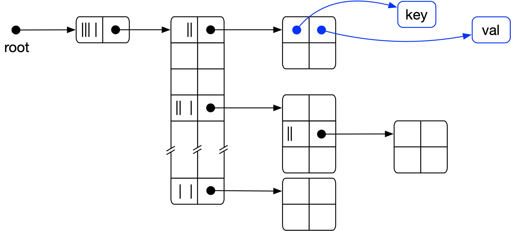

# libhamt
A hash array-mapped trie (HAMT) implementation in C99. The implementation
follows Bagwell's 2000 paper[[1]][bagwell_00_ideal], with a focus on clarity
rather than raw speed.

The original motivation for this effort was the desire to understand and
implement an efficient persistent data structure with structural sharing for
maps and sets for [my own Lisp implementation][stutter].

What prompted the somewhat detailed writeup was the realization that there is
not a lot of in-depth documentation for HAMTs beyond the original Bagwell
paper[[1][bagwell_00_ideal]] Some of the more helpful posts are [Karl Krukow's
intro to Clojure's `PersistentHashMap`][krukov_09_understanding], [C. S. Lim's
C++ template implementation][chaelim_hamt], and [Adrian Coyler's morning paper
post][coyler_15_champ] on compressed HAMTs. There is more, but it's all in bits
and pieces. This is an attempt to (partially) improve that situation.

## Quickstart

To build the library and run the tests:

```bash
$ git clone git@github.com:mkirchner/hamt.git
$ cd hamt
$ make
$ make test
```

In order to use `libhamt` in your own projects, copy `include/hamt.h` and
`src/hamt.c` in your own source tree and build from there.

## Table of Contents

* [Introduction](#introduction)
* [API](#api)
   * [HAMT lifecycle](#hamt-lifecycle)
      * [Memory management](#memory-management)
   * [Query](#query)
      * [Iterators](#iterators)
   * [Modification: Insertion &amp; Removal](#modification-insertion--removal)
   * [Using the HAMT as an efficient persistent data structure](#using-the-hamt-as-an-efficient-persistent-data-structure)
   * [Examples](#examples)
      * [Example 1: ephemeral HAMT w/ standard allocation](#example-1-ephemeral-hamt-w-standard-allocation)
      * [Example 2: Changes required for garbage collection and persistence](#example-2-changes-required-for-garbage-collection-and-persistence)
      * [Example 3: Using iterators](#example-3-using-iterators)
* [Implementation](#implementation)
   * [Setup](#setup)
      * [Project structure](#project-structure)
      * [Building the project](#building-the-project)
   * [Design](#design)
      * [Foundational data structures](#foundational-data-structures)
   * [Hashing](#hashing)
      * [Hash exhaustion: hash generations and state management](#hash-exhaustion-hash-generations-and-state-management)
   * [Table management](#table-management)
   * [Putting it all together](#putting-it-all-together)
      * [Search](#search)
      * [Insert](#insert)
      * [Remove](#remove)
      * [Iterators](#iterators-1)
   * [Persistent data structures and structural sharing](#persistent-data-structures-and-structural-sharing)
      * [Basic idea: path copying](#basic-idea-path-copying)
      * [Insert](#insert-1)
      * [Remove](#remove-1)
* [Appendix](#appendix)
   * [Unit testing](#unit-testing)
* [Footnotes](#footnotes)

# Introduction

A *hash array mapped trie (HAMT)* is a data structure that can be used to
implement [associative arrays][wiki_associative_array] (aka maps) and
[sets][wiki_set_adt].

Structurally, HAMTs are [hash trees][wiki_hash_tree] that combine favorable
characteristics of [hash tables][wiki_hash_table] and array mapped
[tries][wiki_trie], namely almost hash table-like time complexity
guarantees[[1]][bagwell_00_ideal] (O(log<sub>32</sub>n)) and economic use of memory.

An additional benefit, and a key motivation for the work presented here, is that
augmentation of HAMTs with path copying and garbage collection allows for a
straightforward and efficient implementation of [persistent][wiki_persistent]
versions of maps and sets.

The remaining documentation starts with a description of the `libhamt` API and
two examples that demonstrate the use of a HAMT as an ephemeral and persistent
data structure, respectively. I then detail the implementation: starting from
the foundational data structures and the helper code required for hash
exhaustion and table management, we cover search, insertion, removal, and
iterators. The final implementation section introduces path copying and explains
the changes required to support persistent insert and remove operations. We
close with an outlook and an appendix.

# API

## HAMT lifecycle

The key data type exported in the `libhamt` interface is `HAMT`. In order to
create a `HAMT` instance, one must call `hamt_create()`, which requires a
hash function of type `HamtKeyHashFn` to hash keys, a comparison function of
type `HamtCmpFn` to compare keys, and a pointer to a `HamtAllocator` instance.
`hamt_delete()` deletes `HAMT` instances that were created with `hamt_create()`.


```c
typedef struct HamtImpl *HAMT;
typedef int (*HamtCmpFn)(const void *lhs, const void *rhs);
typedef uint32_t (*HamtKeyHashFn)(const void *key, const size_t gen);


HAMT hamt_create(HamtKeyHashFn key_hash, HamtCmpFn key_cmp,
                 struct HamtAllocator *ator);
void hamt_delete(HAMT);
```

The `HamtKeyHashFn` takes a `key` and a generation `gen`. The expectation is
that the supplied hash function returns different hashes for the same key but
different generations. Depending on the choice of hash function this can be
implemented using `gen` as a seed or modifying a copy of `key` on the fly.
See the [examples](#examples) section for a `murmur3`-based implementation and
the [hashing](#hashing) section for more information on suitable hash functions.


### Memory management

`libhamt` exports its internal memory management API through the `HamtAllocator`
struct. The struct specifies the functions that the HAMT implementation uses to
allocate, re-allocate and deallocate system memory. The API provides a default
`hamt_allocator_default` which refers to the standard `malloc()`, `realloc()`
and `free()` functions.

```c
struct HamtAllocator {
    void *(*malloc)(const size_t size);
    void *(*realloc)(void *chunk, const size_t size);
    void (*free)(void *chunk);
};

extern struct HamtAllocator hamt_allocator_default;
```

Exporting the `libhamt` memory management API enables library clients to make
use of alternate memory management solutions, most notably of garbage collection
solutions (e.g. the [Boehm-Demers-Weiser GC][boehm_gc]) which are required when
using the HAMT as a persistent data structure (see the [structural sharing
example](#example-2-garbage-collected-persistent-hamts)).

[boehm_gc]: https://www.hboehm.info/gc/

## Query

```c
size_t hamt_size(const HAMT trie);
const void *hamt_get(const HAMT trie, void *key);
```

The `hamt_size()` function returns the size of the HAMT in O(1). Querying the
HAMT (i.e. searching a key) is done with `hamt_get()` which takes a pointer to a
key and returns a result in O(log<sub>32</sub> n) - or `NULL` if the key does
not exist in the HAMT.

### Iterators

The API also provides key/value pair access through the `HamtIterator` struct.
```c
size_t hamt_size(const HAMT trie);
const void *hamt_get(const HAMT trie, void *key);
```

Iterators are tied to a specific HAMT and are created using the
`hamt_it_create()` function, passing the HAMT instance the iterator should refer
to. Iterators can be advanced with the `hamt_it_next()` function and as long as
`hamt_it_valid()` returns `true`, the `hamt_it_get_key()` and
`hamt_it_get_value()` functions will return the pointers to the current
key/value pair. In order to delete an existing and/or exhausted iterator, call
`hamt_it_delete()`.

```c
typedef struct HamtIteratorImpl *HamtIterator;

HamtIterator hamt_it_create(const HAMT trie);
void hamt_it_delete(HamtIterator it);
bool hamt_it_valid(HamtIterator it);
HamtIterator hamt_it_next(HamtIterator it);
const void *hamt_it_get_key(HamtIterator it);
const void *hamt_it_get_value(HamtIterator it);
```

Note that iterators maintain state about their traversal path and that changes
to the underlying HAMT the iterator refers to, will likely cause undefined
behavior.


## Modification: Insertion & Removal


```c
const void *hamt_set(HAMT trie, void *key, void *value);
void *hamt_remove(HAMT trie, void *key);
```

## Using the HAMT as an efficient persistent data structure

```c
const HAMT hamt_pset(const HAMT trie, void *key, void *value);
const HAMT hamt_premove(const HAMT trie, void *key);
```

## Examples

### Example 1: ephemeral HAMT w/ standard allocation

```c
#include <stdint.h>
#include <stdio.h>
#include <stdlib.h>
#include <string.h>

#include "hamt.h"
#include "murmur3.h"


static uint32_t hash_string(const void *key, const size_t gen)
{
    return murmur3_32((uint8_t *)key, strlen((const char *)key), gen);
}

int main(int argn, char *argv[])
{
    enum { N = 5; };
    struct {
        char *country;
        char *capital;
    } cities[N] = {
        {"Germany", "Berlin"},
        {"Spain", "Madrid"},
        {"Italy", "Rome"},
        {"France", "Paris"},
        {"Romania", "Bucharest"}
        /* ... */
    };

    HAMT t;

    /* create table */
    t = hamt_create(hash_string, strcmp, &hamt_allocator_default);
    /* load table */
    for (size_t i = 0; i < N; i++) {
        hamt_set(t, cities[i].country, cities[i].capital);
    }

    /* query table */
    for (size_t i = 0; i < N; i++) {
        printf("%s has capital %s\n", cities[i].country,
                                      hamt_get(t, cities[i].country));
    }
    /* cleanup */
    hamt_delete(t);
    return 0;
}
```

### Example 2: Garbage-collected persistent HAMTs

The key to making use of structural sharing is to provide `libhamt` with a
`struct HamtAllocator` instance that implements garbage collection.

The example below uses the the Boehm-Demers-Weiser

### Example 3: Using iterators

Introducing iterators is straightforward:

```c
    ...
    HAMT t = hamt_create(hash_string, strcmp, &hamt_allocator_default);

    /* load table */
    ...

    /* create iterator */
    HamtIterator it = hamt_it_create(t);
    while (hamt_it_valid(it)) {
        printf("(%s, %s)\n", (char *)hamt_it_get_key(it),
                             (char *)hamt_it_get_value(it));
        hamt_it_next(it);
    }
    /* clean up */
    hamt_it_delete(it);

    ...
    hamt_delete(t);
    ...
```

# Implementation

## Setup

### Project structure

The `hamt` source tree has the following structure:

```
hamt/
  build/         Out-of-source build destination
  include/       Header files that are part of the interface
  src/           Source and header files
  test/          Test and utility headers & sources
  Makefile
```

Sources are organized in three folders: the `include` folder, for all header
files that are part of the public `hamt` interface; the `src` folder, for the
actual implementation and private header files; and the `test` folder, for all
test code, including headers and sources for testing utilities (e.g. data
loading and benchmarking functions).

The build process is governed by a single Makefile. While one could split the
Makefile by folder, the single-file solution is a better tradeoff for
simplicity.


### Building the project

For the impatient:

```
$ make && make test
```

We use `make` as a build system<sup id="ac_make">[1](#fn_make)</sup>, with
three targets:
1. `make` or `make lib` builds the shared library `libhamt.dylib`
2. `make test` builds a static test executable and runs the tests, and
3. `make perf` builds and executes the performance tests, and creates a simple
   box plot. Plotting requires a Python 3 installation w/ `matplotlib` and
   `pandas` packages.


## Design

### Foundational data structures

<p align="center">
</img>
</p>
<p class="image-caption"><b>Figure 1:</b> HAMT data structure. <pre>libhamt</pre> implements
HAMTs using recursive, heap-allocated tables. Table rows hold one of two types of
items: either an index vector and pointer to a subtable or pointers to key and
value (illustrated in blue, and implicit to all empty table fields).</p>


* What is a trie?

* What is a hash trie?

* Key ideas
  * Rely on hash function for balancing (as opposed to RB/AVR etc trees)
  * 32-ary internal nodes, wide fan-out


distinction between trie with and without inner nodes

One of the potential drawbacks of hash tries is that they grow in depth
linearly with the length of the input. At their core, they are a
memory-efficient but not necessarily a search-efficient representation. Hash
tries partially remedy that situation: they use a hash function to pre-process
the value to be stored in the tree and use the bits of the hash to determine
the location of a particular value in the tree. The number of bits used at
every tree depth determines the fan out factor and the eventual depth of the
tree.

Hash array mapped tries take this idea into prac

enable shallower trees by
increasing the uniformity of the key distribution
A hash trie is a trie that uses the *hash* of a value to determine the
path to and position of the final node in a trie. 

* What is a hash array mapped trie?


* How do we represent the data structure in memory?

* Anchor view
* HamtNode definition

## Hashing

* what is a hash function?
* different classes: cryptographically secure, just efficient


```c
typedef uint32_t (*HamtKeyHashFn)(const void *key, const size_t gen);
```

* hash functions schould be fast and show good distribution
* cryptographical security is not an issue
* examples: Knuth's universal hash, djb2, murmur
* we're choosing murmur3: simple implementation, great properties


```c
#ifndef MURMUR3_H
#define MURMUR3_H

#include <stdint.h>
#include <stdlib.h>

uint32_t murmur3_32(const uint8_t *key, size_t len, uint32_t seed);

#endif
```

This declares the *murmur* hash function. In its standard form `murmur3_32`
takes a pointer `key` to byte-sized objects, a count of `len` that speficies
the number of bytes to hash and a random seed `seed`.

Its [definition][murmur3] is concise:

```c
#include "murmur3.h"

#include <string.h>

static inline uint32_t murmur_32_scramble(uint32_t k)
{
    k *= 0xcc9e2d51;
    k = (k << 15) | (k >> 17);
    k *= 0x1b873593;
    return k;
}

uint32_t murmur3_32(const uint8_t *key, size_t len, uint32_t seed)
{
    uint32_t h = seed;
    uint32_t k;
    /* Read in groups of 4. */
    for (size_t i = len >> 2; i; i--) {
        memcpy(&k, key, sizeof(uint32_t));
        key += sizeof(uint32_t);
        h ^= murmur_32_scramble(k);
        h = (h << 13) | (h >> 19);
        h = h * 5 + 0xe6546b64;
    }
    /* Read the rest. */
    k = 0;
    for (size_t i = len & 3; i; i--) {
        k <<= 8;
        k |= key[i - 1];
    }
    h ^= murmur_32_scramble(k);
    /* Finalize. */
    h ^= len;
    h ^= h >> 16
    h *= 0x85ebca6b;
    h ^= h >> 13;
    h *= 0xc2b2ae35;
    h ^= h >> 16;
    return h;
}
```

[Add some info about murmur3 here]

hamt has unit tests that validate the murmur hash results against know
values (add link here)

In order to use murmur3 as a `hamt` hash function, we need to wrap it into a
helper function:

```c
static uint32_t my_keyhash_string(const void *key, const size_t gen)
{
    uint32_t hash = murmur3_32((uint8_t *)key, strlen((const char *)key), gen);
    return hash;
}
```

Here, the wrapper makes use of `strlen(3)`, assuming valid C strings as keys.
Note the use of `gen` as a seed for the hash.


### Hash exhaustion: hash generations and state management

For a hash trie, the number of elements in the trie is limited by the total number
of hashes that fits into a 32-bit `uint32_t`, i.e. 2^32-1. Since the HAMT only
uses 30 bits (in 6 chunks of 5 bits), the number of unique keys in the trie is
limited to 2^30-1 = 1,073,741,823 keys. 
At the same time, since every layer of the
tree uses 5 bits of the hash, the trie depth is limited to 6 layers.
Neither the hard limit to the number of elements in the trie,
nor the inability to build a trie beyond depth of 6 are desirable properties.

To address both issues, `libhamt` recalculates the hash with a different seed every
32/5 = 6 layers. This requires a bit of state management and motivates the
existence of the `Hash` data type and functions that operate on it:

```c
typedef struct Hash {
    const void *key;
    HamtKeyHashFn hash_fn;
    uint32_t hash;
    size_t depth;
    size_t shift;
} Hash;
```
The struct maintains the pointers `key` to the key that is being hashed and
`hash_fn` to the hash function used to calculate the current hash `hash`. At
the same time, it tracks the current depth `depth` in the tree (this is the
*hash generation*) and the bitshift `shift` of the current 5-bit hash chunk.

The interface provides two functions: the means to step from the current 5-bit
hash to the next in `hash_next()`; and the ability query the current index of a
key at the current trie depth in `hash_get_index()`.

```c
static inline Hash *hash_next(Hash *h)
{
    h->depth += 1;
    h->shift += 5;
    if (h->shift > 30) {
        h->hash = h->hash_fn(h->key, h->depth / 5);
        h->shift = 0;
    }
    return h;
}
```

```c
static inline uint32_t hash_get_index(const Hash *h)
{
    return (h->hash >> h->shift) & 0x1f;
}
```


## Table management

## Putting it all together

### Search

### Insert

### Remove

### Iterators

## Persistent data structures and structural sharing

### Basic idea: path copying

### Insert

### Remove

# Appendix

## Unit testing

For testing, `hamt` uses a variant of [John Brewer's `minunit` testing
framework][brewer_xx_minunit]. Minunit is extremely minimalistic and its
header-only implementation easily fits on a single page:

```c
// test/minunit.h
#ifndef MINUNIT_H
#define MINUNIT_H

#define MU_ASSERT(test, message)                                               \
    do {                                                                       \
        if (!(test))                                                           \
            return message;                                                    \
    } while (0)
#define MU_RUN_TEST(test)                                                      \
    do {                                                                       \
        char *message = test();                                                \
        mu_tests_run++;                                                        \
        if (message)                                                           \
            return message;                                                    \
    } while (0)

#define MU_TEST_CASE(name) static char *name()
#define MU_TEST_SUITE(name) static char *name()

extern int mu_tests_run;

#endif /* !MINUNIT_H */
```

With `minunit`, every unit test is a `MU_TEST_CASE` We use `MU_ASSERT` to test
the test invariants.  Test cases are grouped into `MU_TEST_SUITE`s as
sequential calls to `MU_RUN_TEST`.  When an assertion fails, the `return`
statement in `MU_ASSERT` short-circuts test execution and returns a non-null
pointer to the respective `message` (generally a static string). This, in turn,
causes `MU_RUN_TEST` to issue a `return` call with the string pointer,
short-circuting the remaining test suite. The header also declares a global
variable `mu_tests_run` that keeps track of the total number of executed
tests.

The following listing illustrates the basic structure of unit test
implementations with `minunit`, check the [actual tests](test/test_hamt.c) for
a full listing.

```c
// test/test_hamt.c
#include "minunit.h"
#include "../src/hamt.c"

int mu_tests_run = 0;

MU_TEST_CASE(test_dummy)
{
    /* do something here */
    MU_ASSERT(0 == 0, "Oops X-{");
    return 0;
}

MU_TEST_SUITE(test_suite)
{
    /* Add tests here */
    MU_RUN_TEST(test_dummy);
    /*
     * ... many more ...
     */
    return 0;
}

int main()
{
    printf("---=[ Hash array mapped trie tests\n");
    char *result = test_suite();
    if (result != 0) {
        printf("%s\n", result);
    } else {
        printf("All tests passed.\n");
    }
    printf("Tests run: %d\n", tests_run);
    return result != 0;
}
```

Note that the test setup `include`s the `hamt.c` implementation file. This is a
common trick used in unit testing to gain easy access to testing `static`
functions that would otherwise be inaccessible since they are local to the
`hamt.c` compilation unit. This requires some care in
the Makefile setup in order to avoid symbol duplication.

[bagwell_00_ideal]: https://lampwww.epfl.ch/papers/idealhashtrees.pdf
[brewer_xx_minunit]: http://www.jera.com/techinfo/jtns/jtn002.html
[chaelim_hamt]: https://github.com/chaelim/HAMT
[coyler_15_champ]: https://blog.acolyer.org/2015/11/27/hamt/
[krukov_09_understanding]: http://blog.higher-order.net/2009/09/08/understanding-clojures-persistenthashmap-deftwice.html
[stutter]: https://github.com/mkirchner/stutter
[wiki_associative_array]: https://en.wikipedia.org/wiki/Associative_array
[wiki_hash_table]: https://en.wikipedia.org/wiki/Hash_table
[wiki_hash_tree]: https://en.wikipedia.org/wiki/Hash_tree_(persistent_data_structure)
[wiki_persistent]: https://en.wikipedia.org/wiki/Persistent_data_structure
[wiki_set_adt]: https://en.wikipedia.org/wiki/Set_(abstract_data_type)
[wiki_trie]: https://en.wikipedia.org/wiki/Trie


## Todo

### Basic implementation

- [ ] testing
  - [ ] add mem checks, possibly using the Boehm GC?
- [ ] docs

### Performance testing

- [x] set up perf test tooling
- [ ] implement perf tests suite

### Someday

* Add more iterator tests
* support key/value pairs and sets (?)
* typing solution (`#define *_TYPE` and `#include` approach?)

# Footnotes

<b id="fn_make">[1]</b> `make` first appeared in 1976, has (in numerous
incarnations) stood the tests of time and still is the most straightforward
approach for portable build specifications in small projects (and some would
argue in large ones, too).  [↩](#ac_make)


